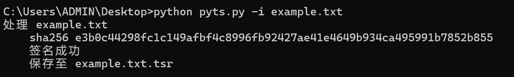
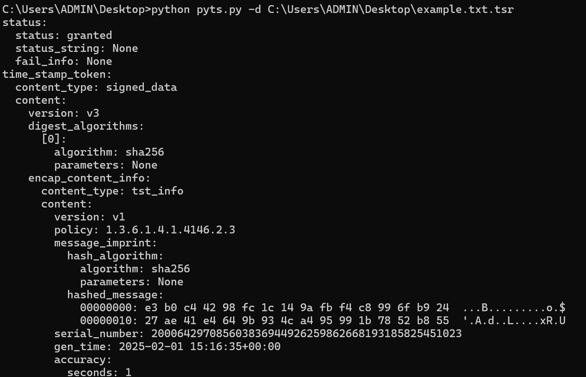

# pyts
A command line tool to create RFC-3161 timestamp signatures

https://crackme.net/articles/tsa/

# 已测试的TSA

| 服务器 | 根证书 |
| ----------- | ----------- |
| http://timestamp.digicert.com | DigiCert Assured ID Root CA |
| http://rfc3161timestamp.globalsign.com/advanced | GlobalSign Root CA - R6 |
| https://timestamp.sectigo.com | USERTrust RSA Certification Authority |

# 示例用法

创建签名

```shell
python pyts.py -i example.txt
```



查看签名

```shell
python pyts.py -d example.txt
```


