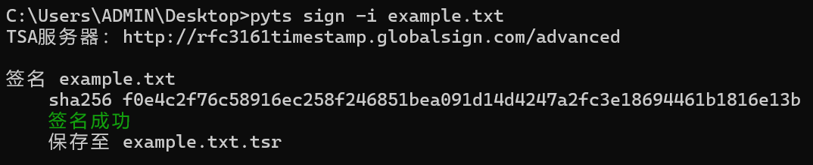

# pyts
A command line tool to create RFC-3161 timestamp signatures

https://crackme.net/articles/tsa/

# 已测试的TSA

| 服务器 | 根证书 | windows系统证书 |
| ----------- | ----------- | ----------- |
| http://timestamp.digicert.com | DigiCert Assured ID Root CA | [x] |
| http://rfc3161timestamp.globalsign.com/advanced | GlobalSign Root CA - R6 | [x] |
| https://timestamp.sectigo.com | USERTrust RSA Certification Authority | [x] | 
| http://timestamp.apple.com/ts01 | Apple Root CA | [ ] |
| http://timestamp.entrust.net/TSS/RFC3161sha2TS | | [x] |
| http://timestamp.comodoca.com/rfc3161 | | [x] |

# 示例用法

安装库

```shell
pip install asn1crypto colorama
```

创建签名

```shell
pyts sign -i example.txt
```



查看签名

```shell
pyts -d example.tsr
```


验证签名

```shell
pyts verify -i example.tsr
```


