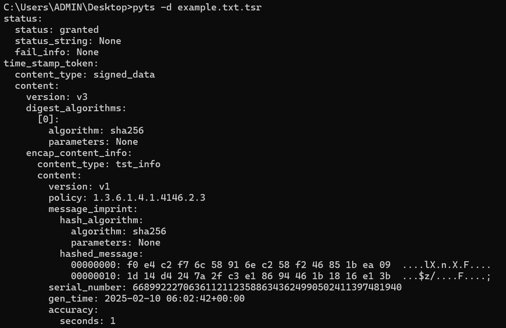
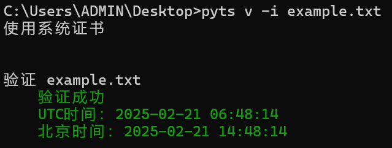

# pyts
A command line tool to create RFC-3161 timestamp signatures

https://crackme.net/articles/tsa/

由于SHA1已经不安全，本软件仅支持SHA256

# 已测试的TSA

| 服务器                                             | 可信度                         | 备注                 |
| ----------------------------------------------- | --------------------------- | ------------------ |
| http://timestamp.digicert.com                   | AATL成员, EUTL成员, Windows系统证书 |                    |
| http://rfc3161timestamp.globalsign.com/advanced | AATL成员, EUTL成员, Windows系统证书 |                    |
| https://timestamp.sectigo.com                   | AATL成员, EUTL成员, Windows系统证书 | 15秒请求限制（官方标注，实测没有） |
| http://timestamp.apple.com/ts01                 |                             |                    |
| http://timestamp.entrust.net/TSS/RFC3161sha2TS  | AATL成员, EUTL成员, Windows系统证书 |                    |
| http://timestamp.comodoca.com/rfc3161           | Windows系统证书                 |                    |
| http://timestamp.acs.microsoft.com              | Windows系统证书                 |                    |
| http://time.certum.pl                           | Windows系统证书, EUTL成员       |                    |

# 示例用法

安装库

```shell
pip install asn1crypto colorama
```

创建签名

```shell
pyts sign -i example.txt
```


查看签名

```shell
pyts -d example.tsr
```



验证签名

```shell
pyts verify -i example.tsr
```


